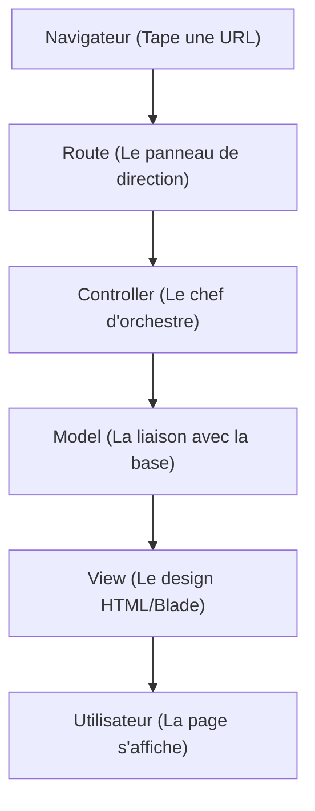

# Documentation complète

Documentation du super site du Pic. Ce site sert à gérer les contenus et services du Pic’Asso (télés, perms, trésorerie, etc.), et à les afficher proprement aux utilisateurs.

---

## 1. Architecture : Le Pattern MVC dans Laravel

Le site est en Laravel. C'est un framework **MVC (Modèle-Vue-Contrôleur)** strict dans lequel on va coder majoritairement en php. L'objectif est la **séparation des préoccupations** (*Separation of Concerns*).  
Pour celles et ceux qui n'ont pas suivi SR03 ou SR10 ou d'autres UVs du type voici un petit récap de ce qu'est le modèle MVC et commment il s'applique à se projet.

### Le concept appliqué au repo :

* **M - Model (`app/Models`)**
    * **Rôle :** Abstraction de la base de données (ORM Eloquent) et logique métier.
    * **Responsabilité :** Chaque classe (ex: `Tv`) correspond à une table SQL (`tvs`). C'est ici que sont définies les relations (`hasMany`, `belongsTo`) et les scopes.
    * *Règle :* Pas de requêtes SQL brutes dans les contrôleurs, on utilise les méthodes du Modèle.

* **V - View (`resources/views`)**
    * **Rôle :** Présentation et interface utilisateur.
    * **Tech :** Moteur de template **Blade** (`.blade.php`).
    * **Responsabilité :** Afficher les données injectées par le contrôleur. Blade compile en PHP pur et permet d'utiliser des structures de contrôle (`@foreach`, `@if`) directement dans le HTML.

* **C - Controller (`app/Http/Controllers`)**
    * **Rôle :** Orchestrateur.
    * **Responsabilité :** Il intercepte la requête HTTP, valide les entrées, appelle les Modèles pour la data, et retourne une Réponse (Vue ou JSON).
    * *Règle :* Un contrôleur doit rester "léger". Il ne contient pas de logique métier complexe (qui devrait être dans un Service ou un Modèle).

---

## 2) Le schéma de fonctionnement

Pour comprendre Laravel, imagine un **tuyau** :



**En langage simple :**  
Quand quelqu’un tape une URL, Laravel suit une route → appelle un contrôleur → récupère des données via un modèle → affiche une vue HTML.

---

## 3) Détail des éléments principaux de la structure

###  `routes/web.php` — La carte des URLs
C’est **le plan des routes**.  
Chaque ligne dit : “Si l’URL est X, alors fais ça”.

Exemple (simplifié) :
````php
Route::get('/TV/{tv}', [\App\Http\Controllers\TvController::class, 'show']);
````

**Traduction :**  
Quand quelqu’un va sur `/TV/quelquechose`, Laravel appelle la méthode `show` du contrôleur `TvController`.


###  `app/Http/Controllers`
Ici on écrit le fonctionnement de chaque page.

**Le contrôleur :**
- récupère des données (depuis les modèles)
- filtre, trie, prépare
- renvoie une vue

Exemple très basique :
````php
public function show(Tv $tv)
{
    $link = $tv->link; // on récupère un lien associé
    return view('TV.display', compact('link'));
}
````

### `app/Models` — Les objets “base de données”
Un **Model** représente une table en base de données.

Exemple :
- `Tv.php` = table `tv`
- `Link.php` = table `link`

Le modèle sert à :
- récupérer les lignes de la base
- définir des relations (ex: une TV a un lien)

Exemple (simplifié) :
````php
class Tv extends Model
{
    public function link()
    {
        return $this->belongsTo(Link::class);
    }
}
````


### `resources/views` — Les pages HTML (avec Blade)
Ici on écrit ce que l’utilisateur voit.

Laravel utilise **Blade**, un mini-langage dans le HTML.

#### Explication rapide de Blade :

Blade mélange du HTML + des petits scripts faciles à lire.


Quelques sintaxes :  
- `{{ $variable }}` : affiche une variable
- `@if` : condition
- `@foreach` : boucle

Exemple Blade :
````blade
<h1>Bienvenue {{ $user->name }}</h1>

@if($user->isAdmin)
    <p>Tu es admin.</p>
@endif

<ul>
@foreach($links as $link)
    <li>{{ $link->name }}</li>
@endforeach
</ul>
````
---


## 4) Debug & Logs

### Où voir les erreurs ?
Toutes les erreurs Laravel sont enregistrées ici :

```
storage/logs/laravel.log
```

**Si ça bug, c’est ici qu’il faut regarder en premier.**

Je vous conseille de vous connecter directement en ssh sur le serveur pour ouvrir ce fichier avec tail et de suivre l'évolution des messages d'erreur en live :

````bash
tail -f storage/logs/laravel.log
````

**`tail -f`** = affiche les nouvelles lignes en temps réel.

Ou bien : 

````bash
tail -n 100 storage/logs/laravel.log
````

Pour afficher les 100 dernières lignes d'erreurs (les erreurs font généralement autour de 60-80 lignes)

---

## 5) Quelques commandes 

###  `php artisan serve`
Lance le serveur local.  
Utile pour tester en local.

````bash
php artisan serve
````

Puis ouvre : `http://127.0.0.1:8000`


###  `php artisan route:list`
Affiche toutes les routes disponibles.  
**Très utile pour retrouver quelle URL correspond à quoi.**

````bash
php artisan route:list
````

Tu verras :
- la méthode HTTP (GET, POST)
- l’URL
- le contrôleur


###  `php artisan migrate`
Applique les migrations de base de données.

````bash
php artisan migrate
````

**Traduction :**  
Laravel crée ou modifie les tables selon les fichiers dans `database/migrations`.


### 🏁 Le mot de la fin

> Rédigé en **A25** par votre super Resp Info, **Clément Chazelas**.
>
> J'encourage mes successeurs à étoffer cette rapide documentation, pour ceux qui viendront après.
> Ne laissont pas ce super projet subir le cycle de renouvellement qu'on voit bien trop souvent dans le paysage associatif de notre belle école.
> 
> **Bon code !** 🚀 


