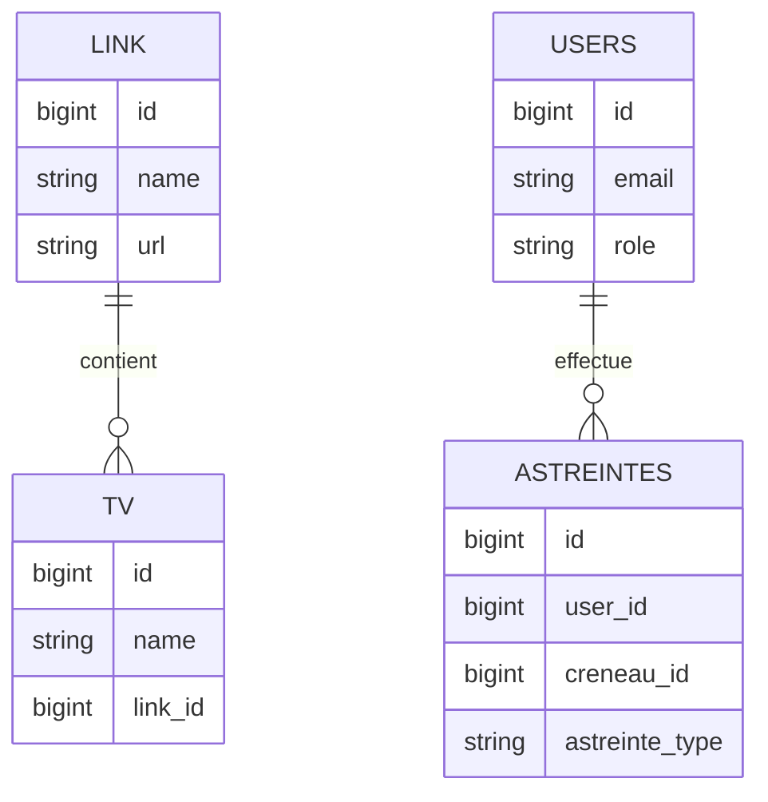

# Documentation complète (ultra-pédagogique) — Projet Laravel Ocktopus

Bienvenue ! Ce document s’adresse à des débutants complets. Ici, on explique **lentement**, **simplement**, et avec **beaucoup d’exemples**.

---

## 1) La philosophie du projet (en une phrase simple)

**Ce site sert à gérer les contenus et services du Pic’Asso (télés, perms, trésorerie, etc.), et à les afficher proprement aux utilisateurs.**

---

## 2) Le schéma de fonctionnement (Mermaid)

Pour comprendre Laravel, imagine un **tuyau** :

```mermaid
graph TD
    A[Mapsur (URL)] --> B[Route]
    B --> C[Controller]
    C --> D[Model/DB]
    D --> E[View (HTML)]
    E --> F[Utilisateur]
```

**En langage simple :**  
Quand quelqu’un tape une URL, Laravel suit une route → appelle un contrôleur → récupère des données via un modèle → affiche une vue HTML.

---

## 3) La Structure pour les Nuls (Détaillée)

### ✅ `routes/web.php` — La carte des URLs
C’est **le plan des routes**.  
Chaque ligne dit : “Si l’URL est X, alors fais ça”.

Exemple (simplifié) :
````php
Route::get('/TV/{tv}', [\App\Http\Controllers\TvController::class, 'show']);
````

**Traduction :**  
Quand quelqu’un va sur `/TV/quelquechose`, Laravel appelle la méthode `show` du contrôleur `TvController`.

---

### ✅ `app/Http/Controllers` — Le “chef cuisinier”
Ici on écrit la **recette** de chaque page.

**Le contrôleur :**
- récupère des données (depuis les modèles)
- filtre, trie, prépare
- renvoie une vue

Exemple très basique :
````php
public function show(Tv $tv)
{
    $link = $tv->link; // on récupère un lien associé
    return view('TV.display', compact('link'));
}
````

**Image mentale :**  
Tu donnes la recette à la cuisine, la cuisine prépare les ingrédients, puis envoie le plat à la table.

---

### ✅ `app/Models` — Les objets “base de données”
Un **Model** représente une table en base de données.

Exemple :
- `Tv.php` = table `tv`
- `Link.php` = table `link`

Le modèle sert à :
- récupérer les lignes de la base
- définir des relations (ex: une TV a un lien)

Exemple (simplifié) :
````php
class Tv extends Model
{
    public function link()
    {
        return $this->belongsTo(Link::class);
    }
}
````

---

### ✅ `resources/views` — Les pages HTML (avec Blade)
Ici on écrit ce que l’utilisateur voit.

Laravel utilise **Blade**, un mini-langage dans le HTML.

#### ✨ Blade pour les nuls :

- `{{ $variable }}` : affiche une variable
- `@if` : condition
- `@foreach` : boucle

Exemple Blade :
````blade
<h1>Bienvenue {{ $user->name }}</h1>

@if($user->isAdmin)
    <p>Tu es admin.</p>
@endif

<ul>
@foreach($links as $link)
    <li>{{ $link->name }}</li>
@endforeach
</ul>
````

**Traduction :**  
Blade mélange du HTML + des petits scripts faciles à lire.

---

## 4) Exemple concret (Trajet d’une page)

**Route choisie :** `/TV/{tv}`

**Trajet exact du code :**
1. **routes/web.php**  
   → `Route::get('/TV/{tv}', [\App\Http\Controllers\TvController::class, 'show'])`

2. **app/Http/Controllers/TvController.php**  
   → méthode `show(Tv $tv)`

3. **app/Models/Tv.php**  
   → relation vers `Link`

4. **app/Models/Link.php**

5. **resources/views/TV/display.blade.php**  
   → affiche un `<iframe>` avec l’URL

---

## 5) Au secours, ça ne marche pas ! (Debug & Logs)

### ✅ Où voir les erreurs ?
Toutes les erreurs Laravel sont enregistrées ici :

```
storage/logs/laravel.log
```

**Si ça bug, c’est ici qu’il faut regarder en premier.**

---

### ✅ Comment lire le fichier ?

Tu peux l’ouvrir avec VS Code ou taper en terminal :

````bash
tail -f storage/logs/laravel.log
````

**`tail -f`** = affiche les nouvelles lignes en temps réel.

---

## 6) Commandes de Survie (Détaillées)

### ✅ `php artisan serve`
Lance le serveur local.  
Utile pour tester en local.

````bash
php artisan serve
````

Puis ouvre : `http://127.0.0.1:8000`

---

### ✅ `php artisan route:list`
Affiche toutes les routes disponibles.  
**Très utile pour retrouver quelle URL correspond à quoi.**

````bash
php artisan route:list
````

Tu verras :
- la méthode HTTP (GET, POST)
- l’URL
- le contrôleur

---

### ✅ `php artisan migrate`
Applique les migrations de base de données.

````bash
php artisan migrate
````

**Traduction :**  
Laravel crée ou modifie les tables selon les fichiers dans `database/migrations`.

---

## 7) Tableau “Je veux faire quoi ?”

| Mon objectif | Où aller dans le code |
|---|---|
| Modifier un texte sur une page | resources/views/** (ex: resources/views/TV/display.blade.php) |
| Changer une URL publique | routes/web.php |
| Ajouter un champ en base de données | database/migrations/** + app/Models/** (ex: migration de la table concernée + modèle associé) |

---

## 8) Schéma simple de la base de données (Mermaid)

Ce schéma est **simplifié** pour débutants.



**Lecture simple :**
- Une TV appartient à un Link
- Un User peut faire plusieurs Astreintes

---

## 9) Mini résumé (si tu es perdu)

✅ **Routes** = plan des URLs  
✅ **Controllers** = recette (récupérer / filtrer / envoyer)  
✅ **Models** = tables SQL en code  
✅ **Views** = HTML avec Blade

---

Si tu veux une version dédiée à un module précis (perms, trésorerie, TV…), dis-le et je l’ajoute.


