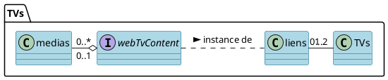

# Gestion des TVs - Documentation Ocktopus

## Les services : 
* **Générale** : gestion de l'affichage des TVs du PIC
* **Précisement** : 
    * Gérer les *liens* affichés par chacune des *TVs*
    * Pouvoir créer, modifier, supprimer les liens disponibles pour les TVs
    * Pouvoir créer, modifier, supprimer, activer et désactiver les *médias* contenu dans le lien par défault

## Fonctionnement général :
On a deux TVs, une au bar et une au salon qui vont être représenter comme deux instances du modèles TV.Ces TVs ont pour attribut un lien, et c'est ce que comporte ce lien (une video, un sondage, le contenu média par défault) qu'affiche la TV. On a donc l'existence de liens qui sont disponibles pour être affiché par les TVs, le lien le plus important est le lien content, ou lien par défault qui affiche les médias activés et qui sont stockés. On a donc aussi un modèle media, qui est soit une image soit une video, dont on peut décider si il est activé ou non, et de son temps d'affichage dans le cas échéant

 

## Les TVs

### Le modèle 
Les *TVs* ont pour attribut un ID comme tout modèle, mais aussi un nom (ex : 'bar Salon'), et ont un lien qui est une clef étrangère de *link*. L'attribut link_id servira ainsi a obtenir le lien que doit afficher la TV concerné.


```php=     
Schema::create('tv', function (Blueprint $table) {
    $table->id();
    $table->string('name', 50);
    $table->foreignIdFor(model: Link::class, column: 'link_id')
        ->nullable();
    $table->timestamps();
});
```
### Ressources Filament :
Classe TvSetupResource

- Modèle associé : Tv::class
- Icône de navigation : 'heroicon-o-tv'
- Groupe de navigation : 'Gestion des télés'
- Libellé de navigation : 'Télés'

#### Fonctions principales :

    form(Form $form): Form : 
Définit le formulaire pour la création et la modification des paramètres de la TV.
Le formulaire de configuration des TVs permet de définir les paramètres suivants pour chaque TV : 
*    Nom de la TV
*    Nom du lien associé
*    URL de la TV


    
    table(Table $table): Table : 
Définit les colonnes et la configuration du tableau pour l'affichage des paramètres des TVs.
Le tableau affiche les paramètres actuels de chaque TV, avec les colonnes suivantes :
* Nom de la TV
* Sélection du lien associé à la TV

Les actions disponibles dans le tableau permettent d'éditer, de supprimer chaque configuration de TV et de visualiser ce que la télé affiche grâce à la view suivante :
* display.blade.php : cette vue recoit un lien correspondant à l'attribut de la TV, et affiche le contenue de l'URL dans iframe plein écran
*

    getPages(): array : 
Renvoie les configurations de pages associées à cette ressource.


## Les links

### Le modèle 
Les *Liens* ont id, un nom et un url. 

```php= 
Schema::create('link', function (Blueprint $table) {
    $table->id();
    $table->string('name', 50);
    $table->string('url', 300);
    $table->timestamps();
});
```
### Ressources Filament :
Classe TVLinkResource

* Modèle associé : Link::class
* Icône de navigation : 'heroicon-o-link'
* Groupe de navigation : 'Gestion des télés'
* Libellé de navigation : 'Liens télés'

#### Fonctions principales :

    form(Form $form): Form :
Définit le formulaire pour la création et la modification des liens TV.
Le formulaire permet de définir les paramètres suivants pour chaque lien TV :
* Nom du lien
* URL du lien
-

    table(Table $table): Table :
Définit les colonnes et la configuration du tableau pour l'affichage des liens TV.


Le tableau affiche la liste des liens TV actuellement disponibles, avec les colonnes suivantes :

* Nom du lien
* URL du lien (truncated to 50 characters)
-

    getPages(): array :
Renvoie les configurations de pages associées à cette ressource.


Les actions disponibles dans le tableau permettent d'éditer et de supprimer chaque lien TV.


## Les médias 

### Le modèle
Les *medias* ont un nom, ont un type qui doit être soit une image soit une vidéo, un chemin d'accès au stockage du média, un état d'activation qui détermine si le média doit être affiché, un times qui représente soit le nombre de seconde que doit être affiché une image, soit le nombre de fois que doit être joué une vidéo avant de laisser place au prochain média activé. 

```php=
Schema::create('media', function (Blueprint $table) {
    $table->id();
    $table->string('name', 50);
    $table->enum('media_type', ['Image', 'Video'])->default('Image');
    $table->string('media_path');
    $table->boolean('activated')->default(0);
    $table->integer('times')->default(1);
    $table->timestamps();
});
```
### Ressources Filament :
Classe MediaResource

* Modèle associé : Media::class
* Icône de navigation : 'heroicon-o-photo'
* Groupe de navigation : 'Gestion des télés'
* Libellé de navigation : 'Médias'

#### Fonctions principales :

    form(Form $form): Form :
Définit le formulaire pour la création et la modification des médias.
Le formulaire permet de définir les paramètres suivants pour chaque média : 
* Le nom du média
* Sa durée d'activation
* Le lien vers le média
* Son état d'activation
*

    table(Table $table): Table :
Définit les colonnes et la configuration du tableau pour l'affichage des médias.
Le tableau affiche la liste des médias, avec les colonnes suivantes : 
* Le nom du média
* Son type (image/vidéo)
* Son état d'activation
* 


    getPages(): array :
Renvoie les configurations de pages associées à cette ressource.

---

### instance particière : content.blade.php ->lien par default

Ce lien récupère tous les médias activés : 
``` php=  
$medias = Media::where('activated', 1)->get();
return view('TV.content', compact('medias'));  
```
et les affiche un par un en boucle (en fonction de l'attribut ```times```) 

Voici une explication de la logique : 
- Notre fichier html a une balise `video` et une balise `image`.
- On a une variable mediaIndex qui va nous permettre de passer d'un média au prochain 
    - est initialisé à 0 puis incrémenter à chaque tour jusqu'à revenir à 0
    
A chaque itération
- Si le média actuel est une image
    - on cache la balise video et on affiche la balise image en mettant à jour la source
    -  on lance son affichage à traver ```showMedia``` qu'on ```setTimeOut``` pour une durée de media.times * 1000 (pour conversion en secondes)
-  Si le média actuel est une vidéo
    - on cache la balise image et on affiche la balise video html en mettant à jour la source
    - se déclence video.load
        -    L'événement `loadedmetadata` est écouté. La vidéo est joué
        -    L'événement `ended` est écouté. Cet événement est déclenché lorsque la lecture de la vidéo est terminée.
            -    Vérifie si la vidéo doit être encore lue plus d'une fois.
            -    Si oui, décrémente la variable times et recharge la vidéo avec video.load();.
            -     Sinon, passe au média suivant  


## UML




