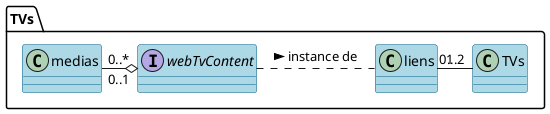

# Les TVs - Documentation Ocktopus

## Les services :
* **Générale** : gestion de l'affichage des TVs du PIC
* **Précisement** :
    * Gérer les *liens* affichés par chacune des *TVs*
    * Pouvoir créer, modifier, supprimer les liens disponibles pour les TVs
    * Pouvoir créer, modifier, supprimer, activer et désactiver les *médias* contenu dans le lien par défault

## Fonctionnement général :
On a deux TVs, une au bar et une au salon qui vont être représenter comme deux instances du modèles TV.Ces TVs ont pour attribut un lien, et c'est ce que comporte ce lien (une video, un sondage, le contenu média par défault) qu'affiche la TV. On a donc l'existence de liens qui sont disponibles pour être affiché par les TVs, le lien le plus important est le lien content, ou lien par défault qui affiche les médias activés et qui sont stockés. On a donc aussi un modèle media, qui est soit une image soit une video, dont on peut décider si il est activé ou non, et de son temps d'affichage dans le cas échéant


## Les TVs

### Le modèle
Les *TVs* ont pour attribut un ID comme tout modèle, mais aussi un nom (ex : 'bar Salon'), et ont un lien qui est une clef étrangère de *link*. L'attribut link_id servira ainsi a obtenir le lien que doit afficher la TV concerné.


```php=     
Schema::create('tv', function (Blueprint $table) {
    $table->id();
    $table->string('name', 50);
    $table->foreignIdFor(model: Link::class, column: 'link_id')
        ->nullable();
    $table->timestamps();
});
```
### Les Méthodes

Empty

### Le controller

1. **`tvs()`**
   le controller *tvs* renvoie une vue avec tous les TVs, afin de pouvoir les visualiser, les éditer, en créer ect.

*Retour :*
- Une instance de la classe View.

2. **`show(Tv $tv)`**
   le controller *show*  recoit une TV en argumant et retourne une vue qui affiche le contenue de la TV concerné
   *Paramètre(s) :*
- une instance du modèle TV

*Retour :*
- Une instance de la classe View.

3. **`create()`**
   le controller *create* retourne la vue pour la création d'une TV

*Retour :*
- Une instance de la classe View représentant la vue du formulaire de création.

4. **`store(Request $request)`**
   le controller *store* enregistre la création d'un média à partir d'une requête recue
   *Paramètre(s)* :
- request : Une instance de la classe Request contenant les données de la requête HTTP. Ici contient les informations nécessaires à la création d'une TV (name et id d'un lien)

5. **```edit(TV $tv)```**
   le controller *edit* retourne la vue pour modifier la TV reçu en paramètre
   *Paramètre(s)* :
- une instance du modèle TV

*Retour :*
- Une instance de la classe View représentant la vue du formulaire de modification.

6. **```update(Request $request, TV $tv)```**
   le controller *update* enregistre les modifications de la TV reçu en paramètre à partir d'une requête reçue en paramètre

*Paramètre(s)* :
- une instance du modèle TV
- request : Une instance de la classe Request contenant les données de la requête HTTP. Ici contient les informations nécessaires à la modification d'une TV (name et id d'un lien)


### Les views

* tvs.blade.php : affiche TV par TV et propose d'éditer,de créer
* create.blade.php : un formulaire pour créer une TV
* edit.blade.php : un formulaire pour éditer une TV, seulement le lien, pas le nom
* display.blade.php : cette vue recoit un lien correspondant à l'attribut de la TV, et affiche le contenue de l'URL dans iframe plein écran


## Les links

### Le modèle
Les *Liens* ont id, un nom et un url.

```php= 
Schema::create('link', function (Blueprint $table) {
    $table->id();
    $table->string('name', 50);
    $table->string('url', 300);
    $table->timestamps();
});
```
### Les méthodes

Empty

### Le controller
1. **```links()```**

Le contrôleur links retourne une vue avec tous les liens, afin de pouvoir les visualiser, les éditer, ou encore les supprimer.

*Retour :*
- Une instance de la classe View représentant la vue.

**```2. create()```**

Le contrôleur create retourne la vue qui est un formulaire pour la création d'un lien.

*Retour :*
- Une instance de la classe View représentant la vue du formulaire de création.

3. **```store(Request $request)```**

Le contrôleur store enregistre la création d'un lien à partir d'une requête reçue.

*Paramètre(s) :*
- request : Une instance de la classe Request contenant les données de la requête HTTP. Ici contient les informations nécessaires à la création d'un lien

*Retour :*
- Une instance de la classe RedirectResponse redirigeant vers la route correspondante.

4. **```edit(Link $link)```**

Le contrôleur edit retourne la vue pour modifier le lien.

*Paramètre(s) :*
- Une instance du modèle Link représentant le lien à modifier.

*Retour :*
- Une instance de la classe View représentant la vue du formulaire de modification.

5. **```update(Request $request, Link $link)```**

Le contrôleur update modifie le lien à partir d'une requête reçue.

*Paramètre(s) :*
* Une instance de la classe Request contenant les données de la requête HTTP. Ici contient les informations nécessaure pour la modification d'un lien (name et url)
* Une instance du modèle Link représentant le lien à modifier.


6. **```destroy(Request $request, Link $link)```**

Le contrôleur destroy détruit le lien.

*Paramètre(s) :*
- Une instance du modèle Link représentant le lien à détruire.

### Les views
* links.blade.php : affiche lien par lien et propose d'éditer,de créer, de supprimer
* link/create.blade.php : un formulaire pour créer un lien
* link/edit.blade.php : un formulaire pour éditer un lien


## Les médias

### Le modèle
Les *medias* ont un nom, ont un type qui doit être soit une image soit une vidéo, un chemin d'accès au stockage du média, un état d'activation qui détermine si le média doit être affiché, un times qui représente soit le nombre de seconde que doit être affiché une image, soit le nombre de fois que doit être joué une vidéo avant de laisser place au prochain média activé.

```php=
Schema::create('media', function (Blueprint $table) {
    $table->id();
    $table->string('name', 50);
    $table->enum('media_type', ['Image', 'Video'])->default('Image');
    $table->string('media_path');
    $table->boolean('activated')->default(0);
    $table->integer('times')->default(1);
    $table->timestamps();
});
```
### Les méthodes
Empty

### Le controller


1. **```medias()```**

Le contrôleur medias retourne une vue avec tous les médias, afin de pouvoir les visualiser, les éditer, ou encore les supprimer.

*Retour :*
- Une instance de la classe View représentant la vue avec la liste de tous les médias.

2. **```create()```**

Le contrôleur create retourne la vue qui est un formulaire pour la création d'un média.

*Retour :*
- Une instance de la classe View représentant la vue du formulaire de création.

3. **```store(Request $request)```**

Le contrôleur store enregistre la création d'un média à partir d'une requête reçue.


*Paramètre(s) :*
- Une instance de la classe Request contenant les données de la requête HTTP. Ici contient les informations nécessaires à la création d'un média


4. **```edit(Media $media)```**

Le contrôleur edit retourne la vue pour modifier le média.

*Paramètre(s) :*
- Une instance du modèle Media représentant le média à modifier.

*Retour :*
- Une instance de la classe View représentant la vue du formulaire de modification.

5. **```update(Request $request, Media $media)```**

Le contrôleur update modifie le média à partir d'une requête reçue.

*Paramètre(s) :*
- Une instance de la classe Request contenant les données de la requête HTTP. Ici contient les informations nécessaires à la modification d'un média
- Une instance du modèle Media représentant le média à modifier.


6. **```destroy(Media $media)```**

Le contrôleur destroy détruit le média en supprimant d'abord le fichier correspondant.


*Paramètre(s) :*
- Une instance du modèle Media représentant le média à détruire.

### les Views

* medias.blade.php : affiche media par media et propose d'éditer,de créer, de supprimer
* medias/create.blade.php : un formulaire pour créer un media
* medias/edit.blade.php : un formulaire pour éditer un media


### instance particière : content.blade.php ->lien par default

Ce lien récupère tous les médias activés :
``` php=  
$medias = Media::where('activated', 1)->get();
return view('TV.content', compact('medias'));  
```
et les affiche un par un en boucle (en fonction de l'attribut ```times```)

Voici une explication de la logique :
- Notre fichier html a une balise `video` et une balise `image`.
- On a une variable mediaIndex qui va nous permettre de passer d'un média au prochain
    - est initialisé à 0 puis incrémenter à chaque tour jusqu'à revenir à 0

A chaque itération
- Si le média actuel est une image
    - on cache la balise video et on affiche la balise image en mettant à jour la source
    -  on lance son affichage à traver ```showMedia``` qu'on ```setTimeOut``` pour une durée de media.times * 1000 (pour conversion en secondes)
-  Si le média actuel est une vidéo
    - on cache la balise image et on affiche la balise video html en mettant à jour la source
    - se déclence video.load
        -    L'événement `loadedmetadata` est écouté. La vidéo est joué
        -    L'événement `ended` est écouté. Cet événement est déclenché lorsque la lecture de la vidéo est terminée.
             -    Vérifie si la vidéo doit être encore lue plus d'une fois.
             -    Si oui, décrémente la variable times et recharge la vidéo avec video.load();.
             -     Sinon, passe au média suivant


## UML




